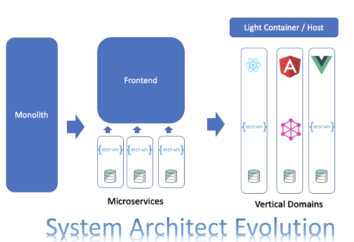
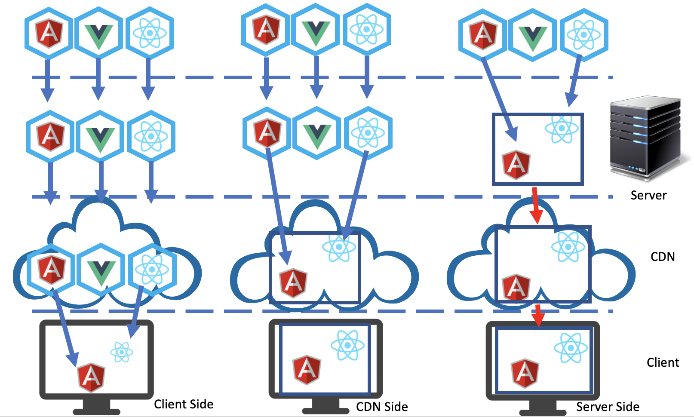

---
# try also 'default' to start simple
theme: seriph
# random image from a curated Unsplash collection by Anthony
# like them? see https://unsplash.com/collections/94734566/slidev
background: https://source.unsplash.com/collection/94734566/1920x1080
# apply any windi css classes to the current slide
class: "text-center"
# https://sli.dev/custom/highlighters.html
highlighter: shiki
# some information about the slides, markdown enabled
info: |
  ## Slidev Starter Template
---

# Mirco-Frontend

Presentation slides for developers

  
    Press Space for next page <carbon:arrow-right class="inline"/>
  

<a href="https://github.com/slidevjs/slidev" target="_blank" alt="GitHub"
  class="abs-br m-6 text-xl icon-btn opacity-50 !border-none !hover:text-white">
<carbon-logo-github />
</a>

<!--
The last comment block of each slide will be treated as slide notes. It will be visible and editable in Presenter Mode along with the slide. [Read more in the docs](https://sli.dev/guide/syntax.html#notes)
-->

---

# Content

In this article, We will take a step back and explain what are Micro Frontends, why do we need to use them, and different ways to implement them.

<li>📝   What? </li>
   
<li>🤹   Why?</li>
   
<li>🧑  How?</li>
 
<li>💻   What are different Frameworks available for Micro-Frontends?</li>
 
<li>🎨  Recommend the solution.</li>

<!--
You can have `style` tag in markdown to override the style for the current page.
Learn more: https://sli.dev/guide/syntax#embedded-styles
-->

---

# What is a Micro-Frontend?

## 

Micro-Frontends Architecture consists of 3 main components:

<ul>
<li>
 <b>Micro-Frontends</b> (in the example the Button from MFE1 is a Micro-Frontend)
</li>
<li><b>A Host/Container </b>(in the example MFE2 was the host)</li>

<li><b>Micro-Frontend framework</b>: We used Webpack 5 Module Federation Plugin for that</li>
</ul>

---

# Why Micro Frontends?

The Micro-Frontends architecture was introduced to solve multiple issues with the current SPA frontend development

Here are some of the benefits of Micro-Frontends

<li> Team Scalability: Multiple teams can work independently to contribute to multiple systems</li>
<li>Single responsibility: This Will allow each team to build components with a single responsibility</li>
<li>Reusability: We will be able to use code in multiple places</li>
<li>Technology agnosticism: Micro Frontends architecture is independent of technology</li>
<li>Learning Curve: For new engineers joining the teams, it is easier to learn smaller apps than understanding a monolith with thousands of lines of code</li>
<li>Domain-Driven Architecture: One of the main reasons behind inventing both Micro-Frontends and Microservices is allowing vertical domain ownership</li>

---

# Why Micro Frontends?

---

# How to implement Micro-Frontends?

The main key in Micro-Frontends is the integration between the host/container and Micro-Frontends. There are two ways to integrate Micro-Frontends

## <li>Build-Time integration</li>

## <li>Run-Time integration</li>

---

# Build-Time integration

This is what most of the code implemented today. The container will install the components as libraries, similar to the libraries you install from npm

<li>
The size of the final package will be big because it contained all dependencies
</li>
<li>
Syncing different versions of libraries and build issues</li>
<li>We have to deploy again for any changes in dependencies</li>
---

# Run-Time integration

Has 3 types of Compositions:

<li>Server-Side Composition</li>
<li>Edge-Side Composition</li>
<li>Client-Side Composition</li>
 

---

# Run-Time integration

 

---

# What are different Frameworks available for Micro-Frontends?

Micro-Frontends is new, and frameworks are evolving. There are several frameworks in the market today

 
<b>1. Webpack Module Federation:</b> allows JavaScript applications to dynamically import code from another application at runtime from different URLs. Webpack provides Build-time and Run-time integrations without the need for a server

<b>
2. Bit: </b> is a Build-Time integration Framework. Bit provides a full framework, including CI/CD pipeline

<b>3. Single-SPA: </b> is similar to Module Federation. Actually, you can use it with Module Federation. It is Run time integration. Single-SPA will take care of most of the Webpack configurations for you. It is a good solution if you do not want to dive deep into Webpack configurations

3. SystemJS

4. Piral

5. Open Components

...

---

# Recommend the solution

Single SPA + Federated Modules = Wow!

Single SPA also gives the ability to:

<li>Deploy independently</li>
<li>Perform lazy loading</li>
<li>Introduce new frameworks without any modification for an existing app</li>

With single-spa, you have two options for choosing the ecosystem for sharing dependencies:

<li><b>Import maps:</b> are not supported in all browsers</li>

<li><b>Module federation in Webpack 5:</b>The main purpose of it is to share code and libraries between applications</li>

---

# Learn More

References

[1. Micro-Frontends: What, why, and how](https://levelup.gitconnected.com/micro-frontends-what-why-and-how-bf61f1f0a729)

[2. Single SPA: The Recommended Setup](https://single-spa.js.org/docs/recommended-setup/#import-maps)

[3. Micro Frontends Using Single-SPA and Module Federation](https://betterprogramming.pub/micro-frontends-using-single-spa-and-module-federation-81ec27d03aee)

---

# Next.js Multi Zones

https://nextjs.org/docs/advanced-features/multi-zones

- A zone is a single deployment of a Next.js app. You can have multiple zones and merge them as a single app.
- For example, let's say you have the following apps:
  - An app for serving `/blog/**`
  - Another app for serving all other pages
- With multi zones support, you can merge both these apps into a single one allowing your customers to browse it using a single URL, but you can develop and deploy both apps independently.
- Can be used in conjunction with micro-frontend

---

# Multi Zone pros

- Faster than micro-frontend
  - Next.js will preload your apps in the background to make them load faster.
  - Preloaded app will load just like they are in the same app with host app, users will feel like they are using a single app.
  - Since both apps are make with Next.js, they share runtime modules.
- Both apps can be deployed independently.
- We can use micro-frontend to share the `shell` between apps.
- Simpler config than microfrontend meaning easier to maintain, more stable.
- Doesn't need to worry about caching compared to Micro-frontend.

---

# Multi Zone cons

- Boths app must be developed with Next.js

---

# Proposed development strategy

- Create private npm repositories to share commonly used packages (components,...) between apps, this can help us maintain them separately.
- Use single-spa as a router for mf and use module federation to load and share Domain modules.
- Expose the `shell` (Layouts,Navbar,...) from the Main App with Module-Federation.
- Develop other Domain apps:
  - If we can make them as pages (Booking page, Inbound page,Outbound page,...) (Recommended) then make them Multi Zone apps and config Main App to load.
  - If they are only components then use single-spa and Module Federation to load them.